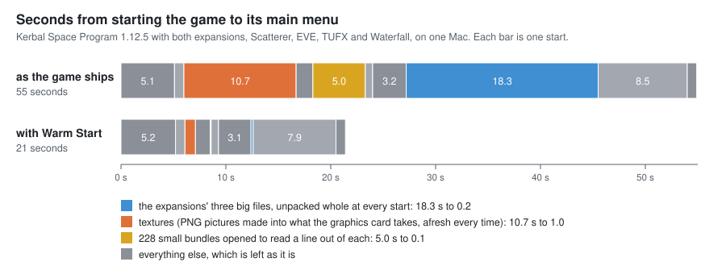

# Warm Start

Kerbal Space Program starts in less than half the time, because what it works out afresh at every start
is kept from the last one.

For Kerbal Space Program 1.12.x. Needs [Keystone](https://github.com/IshiakiZ/ksp-keystone), which comes in the download.

Three things take most of a start, and each comes out the same every time:

* **The expansions' files.** Making History and Breaking Ground keep their models and scenes in three
  files that the game unpacks whole, into memory, at every start. A copy of each is kept that needs no
  unpacking.
* **Textures.** Every PNG picture is unpacked and squeezed into the graphics card's own format, every
  time. What the game makes of each is kept, and handed back. The DDS pictures, which are finished
  already, are read by several threads at once.
* **The small bundles.** The game opens each of a couple of hundred small bundles (its manual's pages,
  mostly) to read a short description out of it. The descriptions are kept.

None of the game's code is changed, and what the game ends up with is what it makes by itself: that was
checked texture by texture and description by description.

## Install

Copy the `Keystone` and `WarmStart` folders from the download's `GameData` into your KSP `GameData`.

The first start after that is as slow as ever, and at its main menu a minute of work goes on in the
background (a line at the foot of the screen says so). From the second start on it is fast.

## What it costs

About a gigabyte of disk, in `GameData/WarmStart/PluginData`: three quarters of it the expansions' copies,
the rest the textures. Deleting that folder loses nothing but the time to make it again.

It costs no memory. With it the game used 1.2 GB *less* here (7.0 GB against 8.2), because the
expansions' files are no longer unpacked into memory whole.

## Settings

In the Keystone window (the keystone button on the game's toolbar, or Option-K on a Mac, Alt-K elsewhere).
Each part can be switched off by itself; what is kept stays on the disk.

| Setting | Installed as | |
| --- | --- | --- |
| Warm start | on | off: the game starts as it always has |
| Textures, ready made | on | PNG pictures kept as the game made them, DDS pictures read ahead |
| What is in the small bundles, kept | on | the descriptions the game reads out of its small bundles |
| The expansions' files, unpacked | on | the copies that need no unpacking (most of the disk) |
| Do not wait on the loading screen | on | the loader does not slow down while one loading picture fades into the next |
| Load at any frame rate | on | the game's frame-rate limit is lifted until the main menu is there |

The page also says how long this start took, and the last one without anything kept.

## Good to know

* When a file changes (a mod updated, added or taken out), only what was kept of that file is made
  again, in the start that follows.
* It does not make everything faster. The game's own start before any mod runs, its parts, and its
  planets and space centre take 17 of the 21 seconds that are left here, and are left alone.
* With **KSP Community Fixes** installed, which loads the game its own, faster way, Warm Start does
  nothing: use one or the other.
* Made and measured on one Mac (Apple silicon, the game under Rosetta, OpenGL), on 2026-10-08. It is
  plain C# with nothing of the Mac's in it, but it has **not been run** on Windows or Linux.

More: [how it works, what was measured and what was tried](docs/How-it-works.md).
